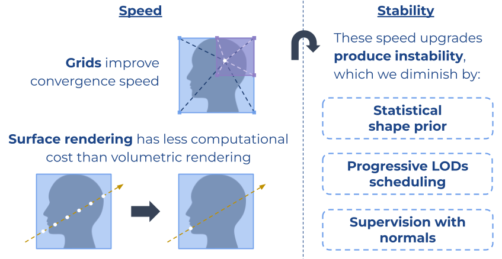
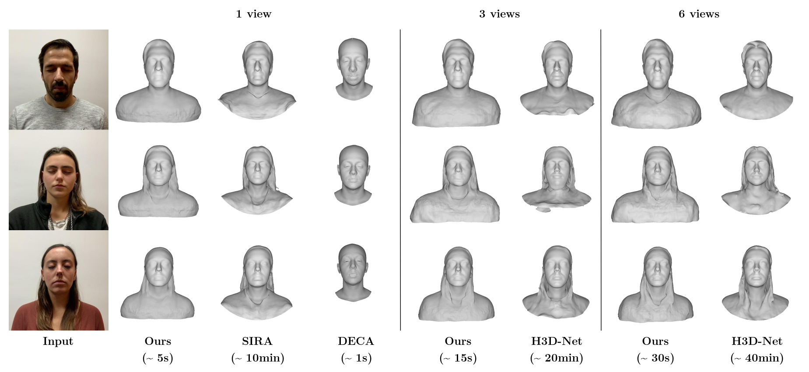
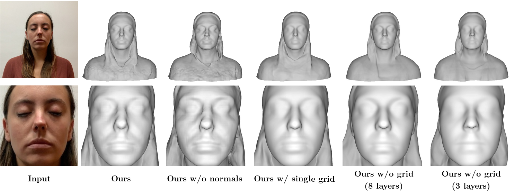

<figure align="center"  style="margin-top: 2em; margin-bottom: 2em">
  
  <figcaption>Figure 1. <b>Reconstruction time comparison.</b></figcaption>
</figure>

## Abstract

Recent advances in full-head reconstruction have been obtained by optimizing a neural field through differentiable surface or volume rendering to represent a single scene. While these techniques achieve an unprecedented accuracy, they take several minutes, or even hours, due to the expensive optimization process required. In this work, we introduce InstantAvatar, a method that recovers full-head avatars from few images (down to just one) in a few seconds on commodity hardware. In order to speed up the reconstruction process, we propose a system that combines, for the first time, a voxel-grid neural field representation with a surface renderer. Notably, a naive combination of these two techniques leads to unstable optimizations that do not converge to valid solutions. In order to overcome this limitation, we present a novel statistical model that learns a prior distribution over 3D head signed distance functions using a voxel-grid based architecture. The use of this prior model, in combination with other design choices, results into a system that achieves 3D head reconstructions with comparable accuracy as the state-of-the-art with a 100x speed-up.

## Method

<figure align="center"  style="margin-top: 2em; margin-bottom: 2em">
  
  <figcaption>Figure 2. <b>Key insights regarding speed and stability.</b></figcaption>
</figure>

Combined with some techniques originated from a few key insights, our rapid 3D reconstruction pipeline builds on top of [IDR](https://arxiv.org/abs/2003.09852) and [H3D-Net](https://arxiv.org/abs/2107.12512). We find that surface rendering is more computationally efficient than volumetric rendering since its sampling size is considerably smaller. Therefore, we show that using grid-based representations together with this efficient rendering increase the speed of convergence significantly. However, both of these concepts make the optimization process more challenging in terms of stability. In order to diminish these side effects: we employ a statistical shape prior for guiding the optimization first steps through a valid latent space; using progressive key schedules to make proper usage of each level-of-detail (similar to concurrent work [Neuralangelo](https://arxiv.org/abs/2306.03092/)); and supervising with normal cues for increasing its robustness.

<figure align="center"  style="margin-top: 2em; margin-bottom: 2em">
  
  <figcaption>Figure 3. <b>Main method pipeline.</b></figcaption>
</figure>

## Results

We next evaluate our 3D reconstruction on multiple real-world portrait photos from the datasets  [H3DS](https://openaccess.thecvf.com/content/ICCV2021/html/Ramon_H3D-Net_Few-Shot_High-Fidelity_3D_Head_Reconstruction_ICCV_2021_paper.html) and [CelebA-HQ](https://arxiv.org/abs/1710.10196).

The proposed method outperforms parametric model-based methods like [Feng et al.](https://dl.acm.org/doi/abs/10.1145/3450626.3459936) and [Dib et al.](https://openaccess.thecvf.com/content/ICCV2021/html/Dib_Towards_High_Fidelity_Monocular_Face_Reconstruction_With_Rich_Reflectance_Using_ICCV_2021_paper.html) in 3D face reconstruction from only 1 view, and per scene optimitzation approaches like [H3D-Net](https://openaccess.thecvf.com/content/ICCV2021/html/Ramon_H3D-Net_Few-Shot_High-Fidelity_3D_Head_Reconstruction_ICCV_2021_paper.html) and [SIRA](https://arxiv.org/abs/2209.03027) in full-head reconstruction.

<figure align="center"  style="margin-top: 2em; margin-bottom: 2em">
  
  <figcaption>Figure 4. <b>Qualitative results.</b> We compare qualitatively InstantAvatar with other state of the art methods on H3DS dataset for 1 view, 3 views and 6 views. 1 view: SIRA is able to better capture the identity of the subject, however, it takes 10 min of training. DECA on the other hand, can only predict the face region. 3 views: H3D-Net achieves good bias but at a high variance where we can clearly see artifacts on the chin and the hair. 6 views: H3D-Net is able to recover the hair and face regions with similar quality as InstantAvatar.</figcaption>
</figure>

<figure align="center"  style="margin-top: 2em; margin-bottom: 2em">
  
  <figcaption>Figure 5. <b>Ablation: Qualitative comparison.</b> We conduct an ablation study to qualitatively compare variations of our model using a H3Ds dataset scene in the multi-view setting (6 views). The bottom row zooms into the face region to better appreciate the differences among configurations. Both our final approach and the one without normals supervision outperform the rest of alternatives. However, when normals supervision is not considered the resulting shape tends to be excessively sharp (e.g. the outermost part of the eyebrows) or erroneous (hair). The single grid and the 8-layer MLP (without grid) results are comparable, although they are both unable to capture the high-frequency details obtained with our final model.</figcaption>
</figure>

<figure align="center"  style="margin-top: 2em; margin-bottom: 2em">
  
  <figcaption>Figure 6. <b>Qualitative results.</b> InstantAvatar results on CelebHQ dataset for a single input image.</figcaption>
</figure>

<figure align="center"  style="margin-top: 2em; margin-bottom: 2em">
  
  <figcaption>Figure 7. <b>3D reconstruction optimization process</b> on commodity hardware (input: <b>1 view</b>).</figcaption>
</figure>

<figure align="center"  style="margin-top: 2em; margin-bottom: 2em">
  
  <figcaption>Figure 8. <b>3D reconstruction optimization process</b> on commodity hardware (input: <b>3 views</b>).</figcaption>
</figure>

<figure align="center"  style="margin-top: 2em; margin-bottom: 2em">
  
  <figcaption>Figure 9. <b>3D reconstruction optimization process</b> on commodity hardware (input: <b>6 views</b>).</figcaption>
</figure>

## BibTeX

```latex
@InProceedings{canela2024instantavatar,
  title={InstantAvatar: Efficient 3D Head Reconstruction via Surface Rendering},
  author={Canela, Antonio and Caselles, Pol and Malik, Ibrar and Ramon, Eduard and Garcia, Jaime and Sanchez-Riera, Jordi and Triginer, Gil and Moreno-Noguer, Francesc},
  booktitle = {International Conference on 3D Vision (3DV)},
  year={2024}
}
```
